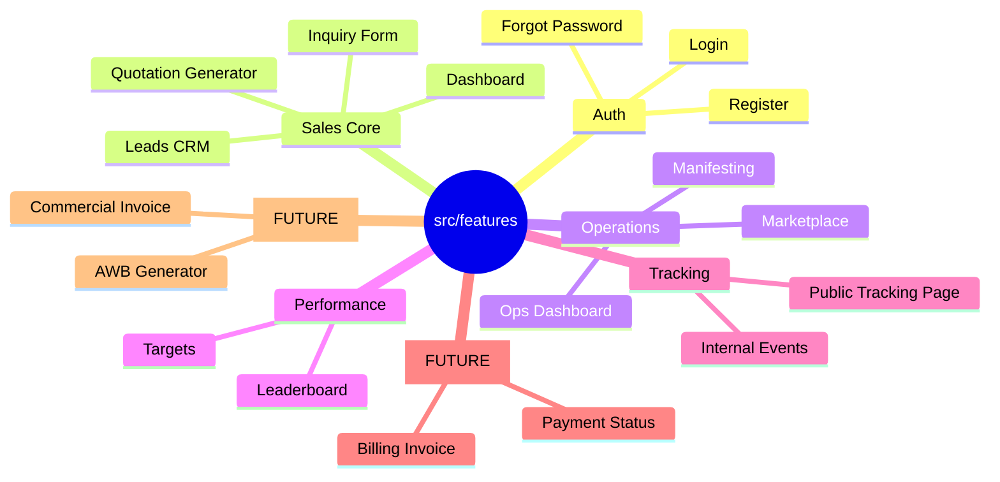

# Modular Architecture Map & Future Roadmap

This document illustrates how we will break down the current monolithic structure into a modern, scalable "Modular Monolith".

## 1. The "Features" Directory Structure
Instead of dumping everything into generic folders (`pages`, `components`), we group by **Business Feature**.

## 2. Detailed Breakdown & Future Modules

### A. Core Modules (Refactoring Targets)
| Feature Module | Files to Move | Responsibility |
| :--- | :--- | :--- |
| **`auth`** | `LoginPage`, `ForgotPassword` | Managing user access & sessions. |
| **`sales`** | `InquiryForm`, `LeadsPage` | The "Money Maker". Inputting orders. |
| **`performance`** | `LeaderboardPage` | **(First Refactor Target)** Gamification & stats. |
| **`tracking`** | `TrackingPage` | Visualizing shipment status. |

### B. Future Modules (Your Requests)
These new features will fit perfectly into the new structure:

#### 1. AWB Copy & Generator
**Location**: `src/features/documents/awb/`
- **Why?**: Separates the *printing logic* from the *input logic*.
- **Components**: `<AWBTemplate />`, `<PrintButton />`

#### 2. Commercial Invoice
**Location**: `src/features/documents/invoice/`
- **Why?**: Needed for export/customs. Complex formatting needs its own space.

#### 3. Invoice Billing (Tagihan)
**Location**: `src/features/finance/`
- **Why?**: "Finance" is different from "Sales". Sales = Deal Closing. Finance = Collecting Money.
- **Future Expansion**: Payment Gateway integration goes here.

## 3. Benefits for IT Team
1.  **Focus**: If fixing a bug in "Tracking", they only open `src/features/tracking`. No distraction from Sales code.
2.  **Scalability**: Adding "Finance" doesn't break "Operations".
3.  **Ownership**: You can assign one freelancer to "Sales" and another to "Tracking" without conflict.
