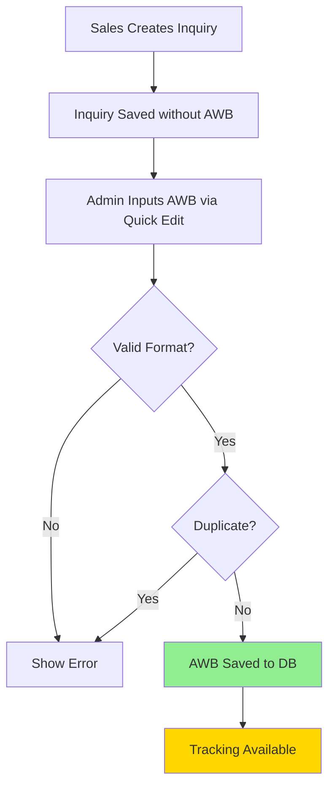

# AWB Number Workflow - Detailed Documentation

> **Last Updated:** 2026-02-07
> **Status:** Manual Input (No Auto-Generation)

---

## Overview

AWB Number is **manually input by admin** with format validation and duplicate checking.

---

## Workflow Diagram



---

## AWB Format

### Pattern
```
ATR-YYYY-MM-ID-SEQ
```

### Example
```
ATR-2026-02-AD-001
```

### Components
- `ATR` - Company prefix (fixed)
- `YYYY` - Year (4 digits)
- `MM` - Month (2 digits)
- `ID` - Sales identifier (2-4 letters, from `profiles.sales_code` or initials)
- `SEQ` - Sequential number (3 digits, zero-padded)

### Validation Regex
```javascript
/^ATR-[0-9]{4}-[0-9]{2}-[A-Z]{2,4}-[0-9]{3}$/
```

---

## Step-by-Step Process

### 1. Admin Inputs AWB
**Location:** `src/features/operations/components/AdminQuickEdit.jsx`

```javascript
// Line 75
<input
    type="text"
    name="awb"
    value={formData.awb}
    onChange={(e) => setFormData(prev => ({ 
        ...prev, 
        awb: e.target.value.toUpperCase() 
    }))}
    placeholder="ATR-2026-02-AD-001"
/>
```

### 2. Format Validation
**Location:** `SIMPLIFY_REVENUE_AWB.sql`

```sql
-- Line 102
IF p_awb_number !~ '^ATR-[0-9]{4}-[0-9]{2}-[A-Z]{2,4}-[0-9]{3}$' THEN
    RETURN jsonb_build_object(
        'success', false,
        'message', 'Invalid AWB format. Expected: ATR-YYYY-MM-ID-SEQ'
    );
END IF;
```

### 3. Duplicate Check
**Location:** `SIMPLIFY_REVENUE_AWB.sql`

```sql
-- Line 110
IF EXISTS (
    SELECT 1 FROM inquiries 
    WHERE awb_number = p_awb_number 
    AND id != p_inquiry_id
) THEN
    RETURN jsonb_build_object(
        'success', false,
        'message', 'AWB number already exists'
    );
END IF;
```

### 4. AWB Saved
**Location:** `SIMPLIFY_REVENUE_AWB.sql`

```sql
-- Line 118
UPDATE inquiries
SET 
    awb_number = p_awb_number,
    updated_at = NOW()
WHERE id = p_inquiry_id;
```

### 5. Tracking Available
**Location:** `src/features/sales/pages/InquiryFormPage.jsx`

```javascript
// Line 481
{formData.awb_number && (
    <a 
        href={`https://atrexinternational.com/track-shipment/?awb=${formData.awb_number}`}
        target="_blank"
        rel="noopener noreferrer"
    >
        🌍 Track
    </a>
)}
```

---

## Database Schema

### Table: `inquiries`
```sql
CREATE TABLE inquiries (
    id UUID PRIMARY KEY,
    customer_name TEXT,
    awb_number TEXT,          -- AWB number (format: ATR-YYYY-MM-ID-SEQ)
    -- ...
);

-- Index for fast lookup
CREATE INDEX idx_inquiries_awb_number ON inquiries(awb_number);
```

---

## API Functions

### `admin_update_awb()`
**Purpose:** Update AWB number with validation

**Parameters:**
- `p_inquiry_id` (UUID) - Inquiry ID
- `p_awb_number` (TEXT) - AWB number

**Returns:** JSONB

**Success:**
```json
{
    "success": true,
    "awb_number": "ATR-2026-02-AD-001"
}
```

**Error (Invalid Format):**
```json
{
    "success": false,
    "message": "Invalid AWB format. Expected: ATR-YYYY-MM-ID-SEQ"
}
```

**Error (Duplicate):**
```json
{
    "success": false,
    "message": "AWB number already exists"
}
```

---

## Frontend Components

### AdminQuickEdit Component
**File:** `src/features/operations/components/AdminQuickEdit.jsx`

**AWB Input Section:**
```javascript
// Line 71
<div>
    <label>AWB Number</label>
    <input
        type="text"
        name="awb"
        value={formData.awb}
        onChange={(e) => setFormData(prev => ({ 
            ...prev, 
            awb: e.target.value.toUpperCase() 
        }))}
        placeholder="ATR-2026-02-AD-001"
    />
    <p className="text-xs text-gray-500 mt-1">
        Format: ATR-YYYY-MM-ID-SEQ
    </p>
</div>
```

---

## Future: Auto-Generation (Optional)

If you want to enable auto-generation in the future:

### Option 1: Generate on Demand
```javascript
// Add "Generate AWB" button
const handleGenerateAWB = async () => {
    const { data } = await supabase.rpc('generate_awb_number', {
        p_inquiry_id: inquiry.id
    });
    
    setFormData(prev => ({ ...prev, awb: data.awb_number }));
};
```

### Option 2: Generate on Quote Approval
```sql
-- In approve_quote function
CREATE OR REPLACE FUNCTION approve_quote(p_inquiry_id UUID)
RETURNS JSONB AS $$
DECLARE
    v_awb TEXT;
BEGIN
    -- Generate AWB
    v_awb := generate_awb_number(p_inquiry_id);
    
    -- Update inquiry
    UPDATE inquiries
    SET awb_number = v_awb,
        status = 'Pending Commission'
    WHERE id = p_inquiry_id;
    
    RETURN jsonb_build_object('success', true, 'awb', v_awb);
END;
$$ LANGUAGE plpgsql;
```

---

## Troubleshooting

### AWB validation fails

**Check format:**
```javascript
const awb = "ATR-2026-02-AD-001";
const isValid = /^ATR-[0-9]{4}-[0-9]{2}-[A-Z]{2,4}-[0-9]{3}$/.test(awb);
console.log(isValid); // Should be true
```

### Duplicate AWB error

**Find existing AWB:**
```sql
SELECT id, customer_name, awb_number
FROM inquiries
WHERE awb_number = 'ATR-2026-02-AD-001';
```

### AWB not showing in tracking

**Check:**
1. Is AWB saved in database?
2. Is tracking link correct?
3. Is external tracking system working?

---

## Code Comments Guide

When editing AWB-related code, add comments:

```javascript
/**
 * AWB WORKFLOW:
 * 1. Admin manually inputs AWB via AdminQuickEdit
 * 2. Format validated: ATR-YYYY-MM-ID-SEQ
 * 3. Duplicate check performed
 * 4. AWB saved to inquiries.awb_number
 * 5. Tracking link available
 * 
 * FUTURE: Can add auto-generation if needed
 */
```

---

## Related Files

- **Frontend:** `src/features/operations/components/AdminQuickEdit.jsx`
- **Backend:** `SIMPLIFY_REVENUE_AWB.sql`
- **Display:** `src/features/sales/pages/InquiryFormPage.jsx` (line 473)
- **Tracking:** External link to `atrexinternational.com`
