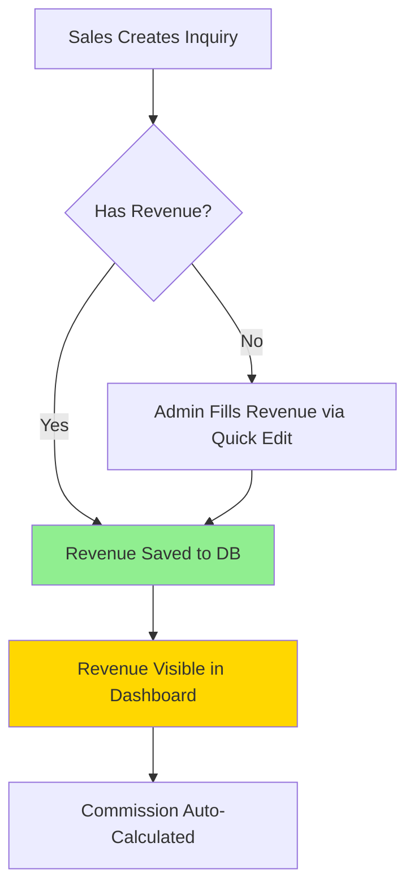

# Revenue Workflow - Detailed Documentation

> **Last Updated:** 2026-02-07
> **Status:** Simplified (No Approval Required)

---

## Overview

Revenue is **editable by admin anytime** and **displays immediately** without approval workflow.

---

## Workflow Diagram



---

## Step-by-Step Process

### 1. Sales Creates Inquiry
**Location:** `src/features/sales/pages/InquiryFormPage.jsx`

Sales can optionally fill estimated revenue when creating inquiry:
```javascript
// Line 37
formData: {
    est_revenue: '',  // Optional estimate
    est_gp: '',       // Optional estimate
    // ...
}
```

### 2. Admin Fills/Edits Revenue
**Location:** `src/features/operations/components/AdminQuickEdit.jsx`

Admin can edit revenue anytime using Quick Edit component:
```javascript
// Line 52
const handleSave = async () => {
    await supabase.rpc('admin_update_inquiry_financials', {
        p_inquiry_id: inquiry.id,
        p_revenue: formData.revenue,
        p_gp: formData.gp,
        p_commission: formData.commission
    });
};
```

### 3. Revenue Saved to Database
**Location:** `SIMPLIFY_REVENUE_AWB.sql`

RPC function updates revenue:
```sql
-- Line 45
CREATE OR REPLACE FUNCTION admin_update_revenue(
    p_inquiry_id UUID,
    p_revenue NUMERIC,
    p_gp NUMERIC,
    p_commission NUMERIC DEFAULT NULL
)
```

### 4. Revenue Displays Immediately
**Location:** `src/features/sales/pages/DashboardPage.jsx`

Dashboard shows all revenue (no approval filter):
```javascript
// Line 147
const totalRevenue = filteredData
    .filter(inq => inq.est_revenue && inq.est_revenue > 0)
    .reduce((sum, inq) => sum + (parseFloat(inq.est_revenue) || 0), 0);
```

---

## Database Schema

### Table: `inquiries`
```sql
CREATE TABLE inquiries (
    id UUID PRIMARY KEY,
    customer_name TEXT,
    est_revenue NUMERIC,      -- Revenue amount (IDR)
    est_gp NUMERIC,           -- Gross Profit (IDR)
    est_commission NUMERIC,   -- Commission (auto: GP * 2%)
    -- ...
);
```

### RLS Policy
```sql
-- Admin can update revenue anytime
CREATE POLICY "admin_full_update_access"
ON inquiries FOR UPDATE
TO authenticated
USING (
    EXISTS (
        SELECT 1 FROM profiles
        WHERE profiles.id = auth.uid()
        AND profiles.role = 'admin'
    )
);
```

---

## API Functions

### 1. `admin_update_revenue()`
**Purpose:** Update revenue and GP for an inquiry

**Parameters:**
- `p_inquiry_id` (UUID) - Inquiry ID
- `p_revenue` (NUMERIC) - Revenue amount
- `p_gp` (NUMERIC) - Gross Profit amount
- `p_commission` (NUMERIC, optional) - Commission (auto-calculated if null)

**Returns:** JSONB
```json
{
    "success": true,
    "revenue": 10000000,
    "gp": 8000000,
    "commission": 160000
}
```

### 2. `admin_update_inquiry_financials()`
**Purpose:** Update revenue, GP, commission, and AWB in one call

**Parameters:**
- `p_inquiry_id` (UUID) - Inquiry ID
- `p_revenue` (NUMERIC, optional) - Revenue amount
- `p_gp` (NUMERIC, optional) - Gross Profit amount
- `p_commission` (NUMERIC, optional) - Commission
- `p_awb_number` (TEXT, optional) - AWB number

**Returns:** JSONB
```json
{
    "success": true,
    "updated": {
        "revenue": 10000000,
        "gp": 8000000,
        "commission": 160000,
        "awb_number": "ATR-2026-02-AD-001"
    }
}
```

---

## Frontend Components

### AdminQuickEdit Component
**File:** `src/features/operations/components/AdminQuickEdit.jsx`

**Purpose:** Allow admin to edit revenue, GP, commission, and AWB

**Props:**
- `inquiry` (Object) - Inquiry data
- `onUpdate` (Function) - Callback after successful update

**Usage:**
```jsx
<AdminQuickEdit 
    inquiry={inquiry} 
    onUpdate={handleRefresh} 
/>
```

**Features:**
- ✅ Auto-calculate commission (GP × 2%)
- ✅ Validate AWB format
- ✅ Save all fields in one call
- ✅ Toast notifications

---

## Future Integration Points

### Rate Calculator Integration
When integrating rate calculator, update `est_revenue` column:

```javascript
// Option 1: Auto-calculate on inquiry creation
const handleSubmit = async () => {
    const calculatedRevenue = await rateCalculator.calculate({
        origin: formData.origin,
        destination: formData.destination,
        weight: formData.weight
    });
    
    inquiryData.est_revenue = calculatedRevenue.revenue;
    inquiryData.est_gp = calculatedRevenue.gp;
    
    await inquiryService.create(inquiryData);
};
```

### API Integration (FedEx/UPS)
Revenue calculation can be fetched from courier APIs:

```javascript
// Fetch rates from FedEx API
const fedexRates = await fedexAPI.getRates({
    origin: inquiry.origin,
    destination: inquiry.destination,
    weight: inquiry.weight
});

// Update revenue with API data
await supabase.rpc('admin_update_revenue', {
    p_inquiry_id: inquiry.id,
    p_revenue: fedexRates.totalCharge,
    p_gp: fedexRates.totalCharge - fedexRates.cost
});
```

---

## Troubleshooting

### Revenue not showing in Dashboard

**Check:**
1. Is `est_revenue` filled in database?
   ```sql
   SELECT id, customer_name, est_revenue 
   FROM inquiries 
   WHERE id = 'YOUR_INQUIRY_ID';
   ```

2. Is user logged in as admin?
   ```sql
   SELECT role FROM profiles WHERE id = auth.uid();
   ```

3. Is RLS policy applied?
   ```sql
   SELECT * FROM pg_policies WHERE tablename = 'inquiries';
   ```

### Cannot edit revenue

**Check:**
1. Is user admin?
2. Is `admin_full_update_access` policy enabled?
3. Check browser console for errors

---

## Code Comments Guide

When editing revenue-related code, add comments:

```javascript
/**
 * REVENUE WORKFLOW:
 * 1. Admin fills revenue via AdminQuickEdit component
 * 2. Revenue saved to inquiries.est_revenue
 * 3. Revenue displays immediately in Dashboard (no approval)
 * 
 * FUTURE: When integrating Rate Calculator, update est_revenue column
 */
```

---

## Related Files

- **Frontend:** `src/features/operations/components/AdminQuickEdit.jsx`
- **Backend:** `SIMPLIFY_REVENUE_AWB.sql`
- **Display:** `src/features/sales/pages/DashboardPage.jsx`
- **Service:** `src/services/inquiryService.js`
