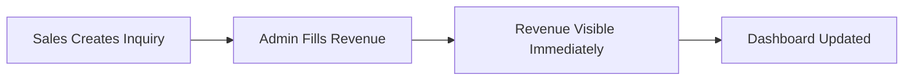
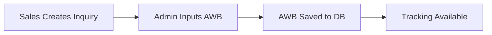
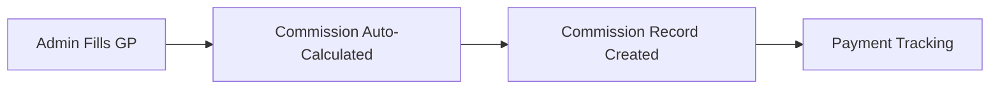
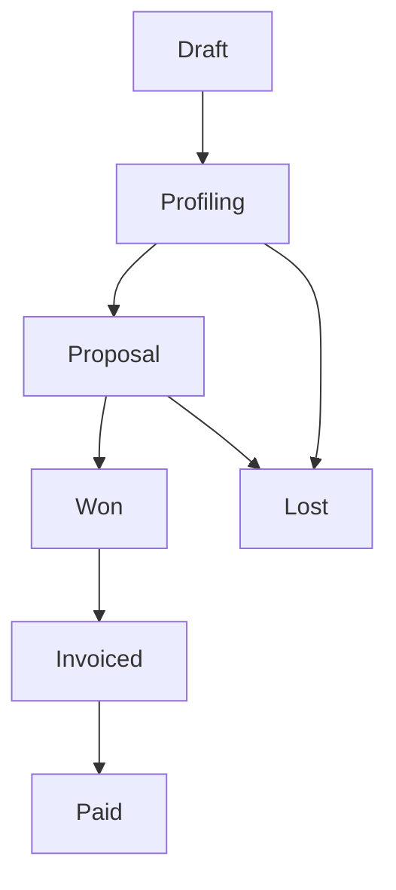

# ATR Sales PWA - Workflows Documentation

> **Purpose:** Master index of all business workflows in the system
> **Audience:** IT Developers, Admin, New Team Members
> **Last Updated:** 2026-02-07

---

## 📚 Table of Contents

1. [Revenue Workflow](#revenue-workflow)
2. [AWB Number Workflow](#awb-number-workflow)
3. [Commission Workflow](#commission-workflow)
4. [Inquiry Lifecycle](#inquiry-lifecycle)

---

## 1. Revenue Workflow

**File:** [REVENUE_FLOW.md](./REVENUE_FLOW.md)

### Quick Summary
Revenue is editable by admin anytime and displays immediately (no approval needed).

### Flow Diagram


### Key Points
- ✅ Admin can edit revenue anytime
- ✅ No approval workflow
- ✅ Revenue visible immediately after admin fills it
- ✅ Target column: `inquiries.est_revenue`

### Code Locations
- **Frontend:** `src/features/operations/components/AdminQuickEdit.jsx`
- **Backend:** `SIMPLIFY_REVENUE_AWB.sql` → `admin_update_revenue()`
- **Display:** `src/features/sales/pages/DashboardPage.jsx` (line 147)

---

## 2. AWB Number Workflow

**File:** [AWB_FLOW.md](./AWB_FLOW.md)

### Quick Summary
AWB is manually input by admin (no auto-generation).

### Flow Diagram


### Key Points
- ✅ Manual input by admin
- ✅ Format validation: `ATR-YYYY-MM-ID-SEQ`
- ✅ Duplicate check
- ✅ No request/approval workflow

### Code Locations
- **Frontend:** `src/features/operations/components/AdminQuickEdit.jsx`
- **Backend:** `SIMPLIFY_REVENUE_AWB.sql` → `admin_update_awb()`
- **Display:** `src/features/sales/pages/InquiryFormPage.jsx` (line 473)

---

## 3. Commission Workflow

**File:** [COMMISSION_FLOW.md](./COMMISSION_FLOW.md)

### Quick Summary
Commission auto-calculated from GP (GP × 2%) and tracked for payment.

### Flow Diagram


### Key Points
- ✅ Auto-calculated: `GP * 0.02`
- ✅ Admin can override if needed
- ✅ Payment status: Pending → Approved → Paid

### Code Locations
- **Calculation:** `src/features/operations/components/AdminQuickEdit.jsx` (line 32)
- **Backend:** `SIMPLIFY_REVENUE_AWB.sql` → `admin_update_revenue()`
- **Display:** `src/features/commission/pages/CommissionPage.jsx`

---

## 4. Inquiry Lifecycle

**File:** [INQUIRY_LIFECYCLE.md](./INQUIRY_LIFECYCLE.md)

### Status Flow


### Status Definitions
- **Draft:** Initial creation
- **Profiling:** Sales gathering info
- **Proposal:** Quote sent to customer
- **Won:** Customer accepted
- **Invoiced:** Invoice sent
- **Paid:** Payment received
- **Lost:** Deal lost

---

## 🏗️ Modular Architecture

### Feature Modules
```
src/features/
├── auth/           # Login, Register, Password Reset
├── sales/          # Inquiry, Dashboard, Leads
├── operations/     # Admin tools, Quick Edit
├── commission/     # Commission tracking & payment
└── performance/    # Leaderboard
```

### Shared Components
```
src/components/     # Buttons, Inputs, Modals
src/lib/            # Supabase client, Utils
src/services/       # API calls (inquiryService, etc)
```

### Rule: Data vs Logic
- **Logic (Code):** Stored in Vercel/Code (`services/`)
- **Data (Numbers):** Stored in Supabase Database

**Example:**
- ❌ Don't hardcode: `commission = gp * 0.02` (in multiple places)
- ✅ Do: `commission = calculateCommission(gp)` (centralized in service)

---

## 🔗 Related Documentation

- [Developer Guide](../DEVELOPER_GUIDE.md) - Architecture overview
- [Revenue Workflow](./REVENUE_FLOW.md) - Detailed revenue flow
- [AWB Workflow](./AWB_FLOW.md) - Detailed AWB flow
- [Integration Guide](./INTEGRATION_GUIDE.md) - Future integrations

---

## 📝 How to Use This Documentation

### For New Developers
1. Read this file first (master index)
2. Read specific workflow files as needed
3. Check code locations for implementation details

### For Debugging
1. Identify which workflow has the issue
2. Read the workflow documentation
3. Check code locations
4. Review inline comments in code

### For Adding Features
1. Document the workflow FIRST
2. Update this index
3. Add code comments
4. Implement the feature
